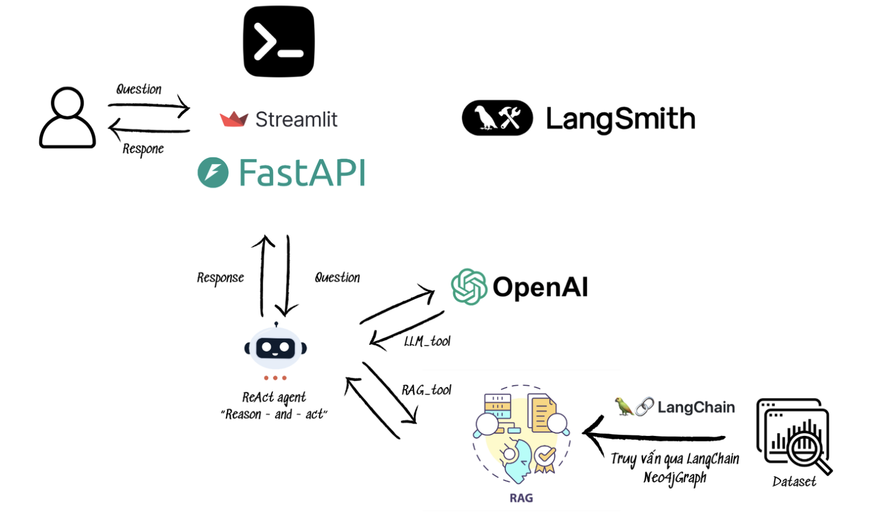
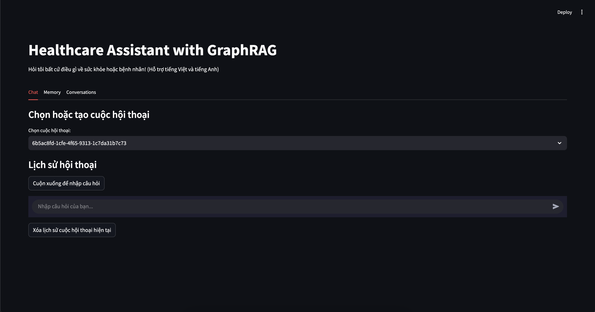

# Healthcare GraphRAG 🏥 

## Chatbot y tế thông minh sử dụng đồ thị tri thức và AI


Healthcare GraphRAG là một hệ thống chatbot thông minh kết hợp cơ sở dữ liệu đồ thị Neo4j với các mô hình ngôn ngữ lớn (LLM) từ Azure OpenAI để trả lời các câu hỏi y tế chính xác và có ngữ cảnh. Dự án sử dụng kỹ thuật Retrieval-Augmented Generation (RAG) dựa trên đồ thị tri thức.

## 📋 Mục lục

- [Tính năng nổi bật](#-tính-năng-nổi-bật)
- [Kiến trúc hệ thống](#-kiến-trúc-hệ-thống)
- [Cài đặt và triển khai](#-cài-đặt-và-triển-khai)
- [Giao diện sử dụng](#-giao-diện-sử-dụng)
- [Cấu trúc dự án](#-cấu-trúc-dự-án)

## ✨ Tính năng nổi bật

- **Truy vấn thông minh**: Tự động chuyển đổi câu hỏi ngôn ngữ tự nhiên thành truy vấn Cypher chính xác
- **Cơ chế ReAct Agent**: Lựa chọn thông minh giữa RAG và LLM tùy theo loại câu hỏi
- **Đa ngữ**: Hỗ trợ tiếng Việt và tiếng Anh
- **Lưu trữ hội thoại**: Lưu và quản lý các cuộc hội thoại trong cơ sở dữ liệu Neo4j
- **Đa nền tảng**: Giao diện web (Streamlit), API (FastAPI) và CLI
- **Hệ thống bộ nhớ**: Duy trì ngữ cảnh và lịch sử hội thoại
- **Giải thích lý luận**: Hiển thị quá trình suy luận thông qua các truy vấn Cypher
## **Kiến trúc hệ thốnge**


## 🏗 Kiến trúc hệ thống

```plaintext
healthcare-graphrag/
├── .env                       # Biến môi trường (Neo4j, API keys)
├── .env.example               # Mẫu biến môi trường
├── .gitignore                 # Cấu hình Git ignore
├── schema.cypher              # Define Schema
├── docker-compose.yml         # Cấu hình Docker Compose (Neo4j, API, UI, CLI)
├── docker-entrypoint.sh       # Script khởi động cho containers
├── Dockerfile                 # Cấu hình build image Docker
├── main.py                    # Điểm khởi chạy chính của ứng dụng
├── README.md                  # Tài liệu dự án
├── requirements.txt           # Dependencies Python
│
├── assets/                    # Tài nguyên tĩnh
│   └── images/                # Hình ảnh cho tài liệu và UI
│       ├── 1.png
│       └── graphrag.png
│
├── backup/                    # Thư mục chứa file dump Neo4j
│   └── neo4j.dump             # File dump cơ sở dữ liệu Neo4j
│
├── data/                      # Dữ liệu nguồn
│   └── healthcare.csv         # Dữ liệu y tế dạng CSV
│
├── neo4j/                     # Cấu hình Neo4j
│   └── entrypoint.sh          # Script khởi động cấu hình Neo4j
│
└── src/                       # Mã nguồn chính
    ├── config/                # Cấu hình ứng dụng
    │   ├── settings.py        # Cài đặt cấu hình chính
    │   └── __pycache__/
    │
    ├── handlers/              # Xử lý logic nghiệp vụ
    │   ├── conversation_handler.py   # Quản lý hội thoại
    │   ├── graph_manager.py          # Xử lý đồ thị Neo4j
    │   ├── graphrag_handler.py       # Xử lý GraphRAG
    │   ├── llm_manager.py            # Quản lý LLM
    │   ├── memory_manager.py         # Quản lý bộ nhớ
    │   └── __pycache__/
    │
    ├── helpers/               # Tiện ích hỗ trợ
    │   ├── agent_initializer.py      # Khởi tạo ReAct Agent
    │   ├── llm_initializer.py        # Khởi tạo LLM
    │   └── ...
    │
    └── routers/               # Các giao diện người dùng
        ├── api_router.py       # Giao diện FastAPI
        ├── cli_router.py       # Giao diện dòng lệnh
        └── ui_router.py        # Giao diện Streamlit
```
Healthcare GraphRAG là một ứng dụng theo mô hình kiến trúc phân lớp với các thành phần chính:

1. **Lớp giao diện người dùng**: 
   - Giao diện web tương tác (Streamlit)
   - API RESTful (FastAPI) 
   - Giao diện dòng lệnh (CLI)

2. **Lớp xử lý**:
   - ReAct Agent đưa ra quyết định sử dụng công cụ nào
   - Trình quản lý bộ nhớ và lịch sử hội thoại
   - Cơ chế theo dõi và phân tích việc sử dụng (LangSmith)

3. **Lớp công cụ**:
   - GraphRAG (Truy xuất dữ liệu từ Neo4j và tăng cường câu trả lời)
   - LLM Tool (Xử lý truy vấn kiến thức chung)

4. **Lớp dữ liệu**:
   - Neo4j Graph Database (dữ liệu y tế và lịch sử hội thoại)
   - Azure OpenAI (Mô hình ngôn ngữ)

## 📋 Điều kiện tiên quyết

Để chạy dự án này, bạn cần cài đặt các công cụ sau:
- **Git**: Để clone repository (tải tại [https://git-scm.com/](https://git-scm.com/)).
- **Python 3.9+**: Đảm bảo bạn đã cài Python (tải tại [https://www.python.org/](https://www.python.org/)).
- **Docker**: Cần thiết nếu bạn muốn chạy qua Docker (tải tại [https://www.docker.com/](https://www.docker.com/)).
- **Docker Compose**: Đi kèm với Docker Desktop trên Windows/Mac, hoặc cài riêng trên Linux.

### Cấu hình môi trường
Sao chép file `.env.example` thành `.env` và điền các giá trị:
- `NEO4J_PASSWORD`: Đặt mật khẩu bất kỳ cho Neo4j (ví dụ: `password123`).
- `LANGCHAIN_API_KEY`: Lấy từ [LangSmith](https://smith.langchain.com/) sau khi đăng ký.
- `GITHUB_TOKEN`: Tạo từ [GitHub Settings](https://github.com/settings/tokens) nếu cần.
## Setup

1. Clone the repository
    ```bash
    git clone https://github.com/quanglekim021223/GraphRAG.git
    cd healthcare-graphrag
    ```
2. Create a virtual environment (choose one method):

    Using venv:
    ```bash
    python -m venv venv
    source venv/bin/activate  # On Windows: venv\Scripts\activate
    ```

    Using conda:
    ```bash
    conda create -n healthcare-graphrag python=3.9
    conda activate healthcare-graphrag
    ```
3. Install dependencies:

    ```bash
    pip install -r requirements.txt
    ```

4. Download file dump Neo4j
    ```bash
    wget https://mega.nz/file/grA1SaKJ#AzeKD25EmC09aKqKsb0jmGpQYrX3hR6gZqafXqQHjq4 -O backup/neo4j.dump
    ```
## Cấu hình môi trường

Tạo file `.env` với nội dung sau:
```bash
NEO4J_URI=bolt://localhost:7689
NEO4J_USERNAME=neo4j
NEO4J_PASSWORD=your_password_here

# LangSmith tracing
LANGCHAIN_TRACING_V2=true
LANGCHAIN_PROJECT=HealthcareGraphRAG
LANGCHAIN_API_KEY=your_langsmith_api_key_here
# Logging
LOG_LEVEL=INFO
# GitHub token
GITHUB_TOKEN=your_github_token_here
```

## 🐳 Hướng dẫn Docker
Lưu ý quan trọng: Quá trình cần thực hiện 2 bước:

Chạy neo4j-loader để import file dump
Sau đó chạy neo4j và các service khác

### Bước 1: Import dữ liệu với neo4j-loader
Bỏ comment phần neo4j-loader trong file docker-compose.yml
Chạy neo4j-loader để import dữ liệu
```bash
docker-compose up neo4j-loader
```

Đợi cho đến khi thấy thông báo "Database import completed!" và container tự dừng

### Bước 2: Khởi động toàn bộ stack
Khởi động Neo4j và các service khác
```bash
docker-compose up -d
```
Đợi khoảng 60 giây để Neo4j khởi động hoàn tất

### Kiểm tra hoạt động
Kiểm tra các container đang chạy
```bash
docker-compose ps
```
Xem log của Neo4j
```bash
docker-compose logs -f neo4j
```
Kiểm tra dữ liệu trong Neo4j
```bash
docker-compose exec neo4j cypher-shell -u $NEO4J_USERNAME -p $NEO4J_PASSWORD "MATCH (p:Patient) RETURN count(p) AS PatientCount;"
```

### Truy cập các dịch vụ
- **Neo4j Browser**: http://localhost:7474 (đăng nhập với thông tin từ file .env)
- **Streamlit UI**: http://localhost:8501
- **FastAPI**: http://localhost:5000 (hoặc cổng đã cấu hình trong .env)

- **Streamlit**: Giao diện web tương tác để trò chuyện với chatbot.
- **FastAPI**: API RESTful để tích hợp chatbot vào ứng dụng khác.
- **CLI**: Giao diện dòng lệnh để sử dụng nhanh qua terminal.

## Hướng dẫn chạy non-Docker
- **Để chạy Streamlit UI**: 
```bash
python main --mode streamlit
```
- **Để chạy FastAPI API**: 
```bash
python main --mode api
```
- **Để chạy CLI**: 
```bash
python main --mode cli
```

### Giao diện Streamlit


## 🔄 Khắc phục sự cố

### Lỗi kết nối Neo4j
Nếu gặp lỗi "No node label 'Patient' in the schema":

```bash
# Chạy script cập nhật schema
docker-compose exec neo4j cypher-shell -u $NEO4J_USERNAME -p $NEO4J_PASSWORD "CALL db.schema.visualization();"
docker-compose exec neo4j cypher-shell -u $NEO4J_USERNAME -p $NEO4J_PASSWORD "CALL apoc.meta.schema();"
```

### Lỗi không tìm thấy file dump
Kiểm tra đường dẫn file dump trong thư mục backup:

```bash
ls -la backup/
docker-compose exec neo4j ls -la /backups
```
